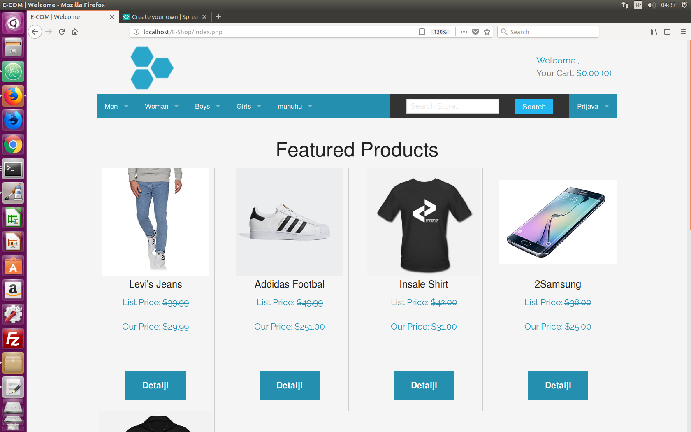

# E-Com Application
> This is my Php application inspired by E commerce store idea.

[![Website link]][npm-url]

An PHP ecommerce app that allows you to:
1. Process orders from customers and accept test Stripe payments.
2. Manage inventory in your Admin dashboard or in the admin area on the website.

## Usage example

Currently in developer mode. Dont use in production.

## Release History

* 0.2.1
    * CHANGE: Uploaded to digital ocean (Ubuntu 16.04 Droplet)
* 0.2.0
    * CHANGE: New frontend view and admin panel
    * CHANGE: Bootstrap modal implemented on Foundation framework
* 0.1.1
    * FIX: Modal issues
* 0.1.0
    * The first init
* 0.0.1
    * Work in progress

## Meta

Domagoj Glavačević – glavacevic.d@gmail.com

[https://github.com/lodi432/E-Shop(https://github.com/E-Shop/)

### Admin area
Go to /admin to manage your products, categories and sub categories, brands and orders.

<!-- Markdown link & img dfn's -->

[npm-url]: http://167.99.89.225/
